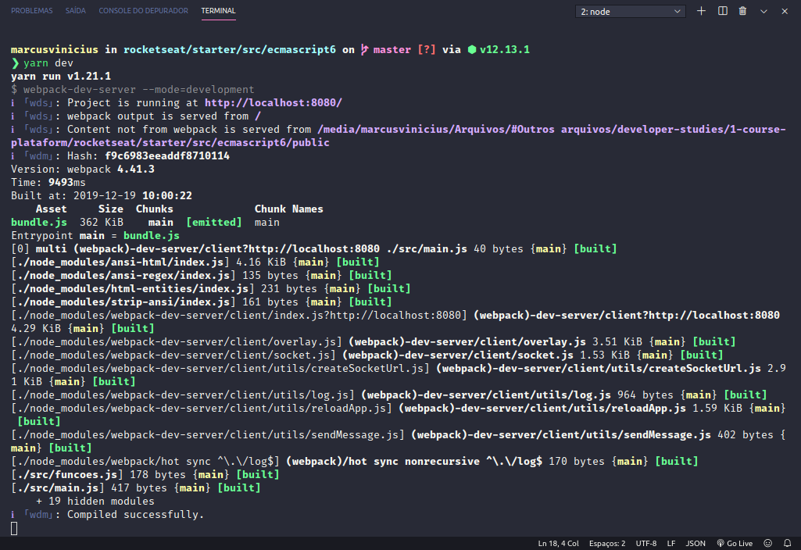
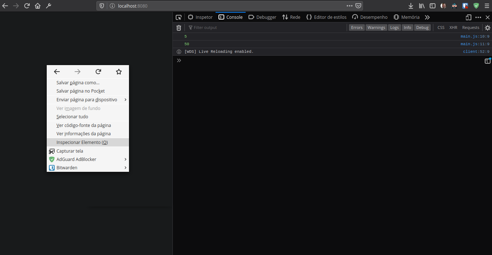

[home](../README.md) < es6

# Projeto com ES6+

## Gerenciando o projeto com _Yarn_

`$ yarn --version`

## Iniciando um projeto com yarn

Na raiz do projeto:

`$ yarn init`

## Adicionando dependências

`$ yarn add @babel/cli`
>_Dependência inicial para o uso do Babel, que **transpila o código es6+ para javascript vanilla**_

`$ yarn add @babel/preset-env`
>_o preset-env diz qual é o ambiente de trabalho. O ambiente pode ser browser, node, react..._

_Veja dependências adicionadas automaticamente ao package.json_

>_**package.json**_ guarda o registro das depêndencias do projeto

>_**yarn.lock** guarda o cache das dependências instaladas_

>_**node_modules** guarda as dependências do projeto (contêm as instalações)_

Criar um arquivo _.babelrc_ para configurações do Babel, e popular assim:

```
{
	// presets = predefinições // o babel tem vários presets
	
	"presets": [
		"@babel/preset-env"
	], 
	"plugins": [
		"@babel/plugin-proposal-object-rest-spread"
	]
}
```
## Configuração inicial dos _Scripts_

Em package.json adicionar o script:

```
"scripts": {
    "dev": "babel .main.js -o bundle.js"
  }
  ```
  
  >_**main.js** é o arquivo com código es6+_
  
  >_**dev** é o nome do script (como será chamado via linha de comando)_
  
  >_Esse script servirá para gerar o bundle (arquivo que contém o .js "transformado")_

### Executando:

`$ yarn dev`
>_Vê o **bundle.js**?_

### Para a aplicação fazer reloads automáticos:

`"dev": "babel ./main.js -o ./bandler.js -w"`
>_**-w** serve para monitorar os arquivos_

Para usar o operador **Rest/Spread** (Caso não venha por padrão no node_modules) 

`$ yarn add @babel/plugin-proposal-object-rest-spread`
>_Esse novo recurso pode ser adicionado como **plugin do Babel** porém pode já estar presente no projeto_

--------------

## Webpack

O webpack é como se fosse um serviço para trabalhar com vários .js na aplicação, além de outros tipos de pastas e arquivos, tudo atráves do javascript. Ele converte tudo em um único arquivo bundle.js

Antes de configurar o projeto em si organizar um pouco as pastas.

`$ mkdir src public`

>_Em **src**: colocar arquivos de códigos .js (main.js)_

>_Em **public**: colocar arquivo que será a página da aplicação (index.html)_

### Para adiciona-lo ao projeto:

`$ yarn add webpack webpack-cli -D`
>_**-D** serve para adicionar com devDependencies (ao invés de dependencies), veja o package.json_

`$ yarn add babel-loader -D`
>_**babel-loader** serve para gerar o bundle com utilizando webpack_

Em _package.json_ trocar _"babel ./main.js -o ./bundle.js -w"_ para chamar o webpack:

`"dev": "webpack --mode=development -w"`

Na raiz do projeto...
`$ yarn dev`

## webpack-dev-server

`$ yarn add webpack-dev-server -D`

Modificar o script _dev_ novamente

```
"scripts": {
    "dev": "webpack-dev-server --mode=development"
  }
```

Remova o bundle.js. O webpack-dev-server automaticamente imbute o arquivo bundle.js sem a necessidade de criar um arquivo visível no projeto

### Crie e popule o _webpack.config.js_

```
module.exports = {
    entry: './src/main.js', // arquivo principal // onde iremos escrever o código es6+
    output: { // lugar e arquivo para onde vai o código transpilado
        path: __dirname + '/public', 
        //__dirname é a variável global que se refere ao diretório onde está o arquivo de configuração do webpack (raiz) 
        filename: 'bundle.js',
    },
    devServer: {
        contentBase: __dirname + '/public' // caminho onde deve abrir o servidor da aplicação
    },
    module: {
        rules: [// Propriedade obrigatória // Regras // Como o webpack deve se comportar quando o usuário estiver tentando importar novos arquivos .js
            // Loaders
            {
                test: /\.js$/, // expressão regular // arquivos com final .js
                exclude: /node_modules/, // excluir a pasta node_modules, pra o js não executar nada de dentro dos modulos
                use: {
                    loader: 'babel-loader', // yarn add babel-loader -D
                }
            }
        ],
    },
}
```

### Arquivo package.json final

```
{
  "name": "ecmascript6",
  "version": "1.0.0",
  "main": "index.js",
  "license": "MIT",
  "devDependencies": {
    "@babel/cli": "^7.7.4",
    "@babel/core": "^7.7.4",
    "@babel/preset-env": "^7.7.4",
    "babel-loader": "^8.0.6",
    "webpack": "^4.41.3",
    "webpack-cli": "^3.3.10",
    "webpack-dev-server": "^3.10.0"
  },
  "scripts": {
    "dev": "webpack-dev-server --mode=development"
  }
}
```

### Para visualizar os efeitos no browser

Na raiz do projeto...
`$ yarn dev`

Basta acessar <http://localhost:8080/> conforme indica a terceira linha após a execução do comando acima



Para visualizar o console...



### Para o uso em produção...

Modificar o script _dev_:

```
"scripts": {
	// "dev": "webpack-dev-server --mode=development"
	"build": "webpack --mode=production"
  }
  ```
  
  >_Note que o **bundle.js** está de volta..._
