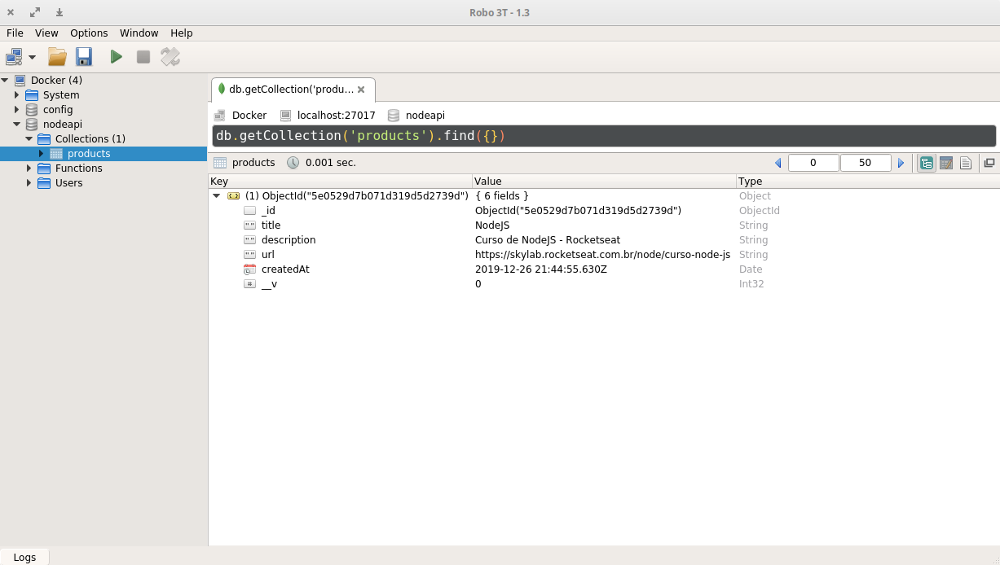
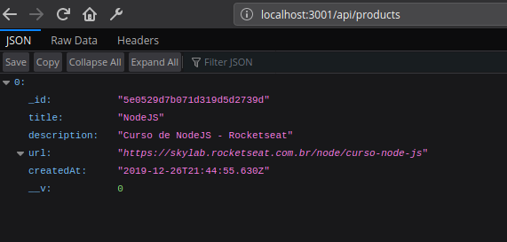
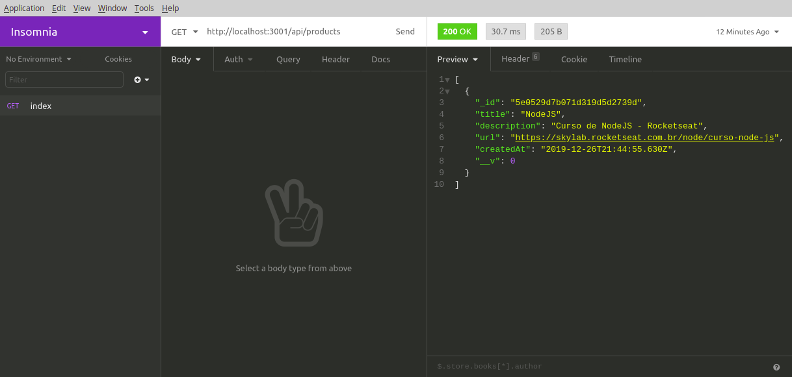
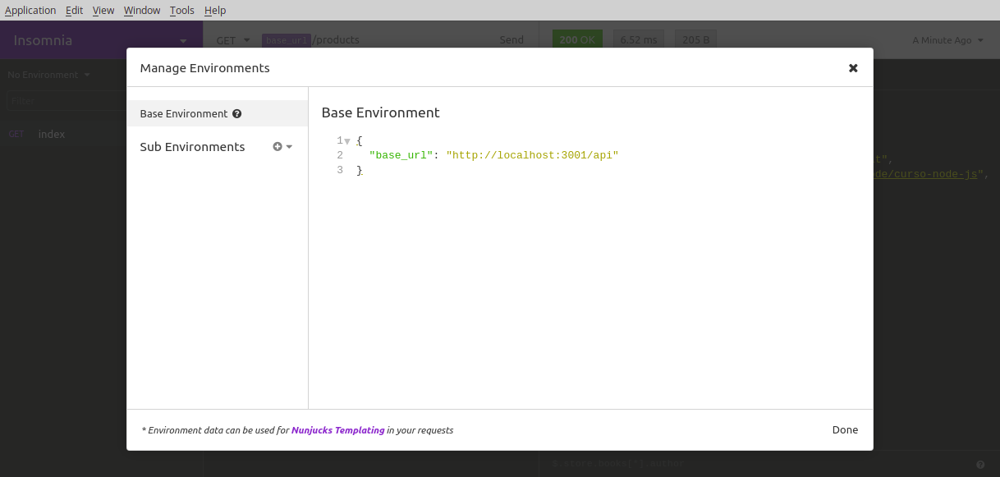

[home](../README.md) < nodejs

# NodeJS

## Criando a estrutura

`$ npm init -y `

_Inicia o **node_modules** (Onde ficaram as dependências instaladas) e cria o arquivo **package.json**, nele estão algumas instruções de como nossa aplicação deve ser comportar, e principalmente, este arquivo vai guardar as versões das dependências adicionadas ao projeto. o **-y** é um parâmetro que indica que queremos iniciar com uma configuração default (yes>yes>yes...). O package-lock.json serve como um cache dos pacotes, contendo o versionamento e outras informações necessárias para evitar a redundância de instalações, por exemplo._

### Express

`$ npm install express`

_O Express é um micro-framework que auxilia o uso de rotas (endereços URLs..) e views (Formas de visualização). O comando acima pega a ultima versão instável..._

### Arquivo principal

Criar arquivo **server.js** ou **index.js**... 

Popular assim:

```
const express = require('express') 
// importação do express // retorna uma função

const app = express()

app.get('/', (req, res)) {
	res.send('Hello NodeJS')
}
// '/' -> rota raiz 
// req -> rerquisição feita ao servidor (contém todos os detalhes da requisição)
// res -> resposta dada a requisição

app.listen(3001)
// A app está "ouvindo" na porta 3001
```

Rodar:

`$ node server.js`

Acessar [localhost:3001](http://localhost:3001)

### Nodemon

`$ npm install -D nodemon`

_O Nodemon serve para fazer a re-inicialização do servidor sempre que houver alguma mudança, ele fica monitorando alterações. O **-D** (--save-dev) é o parâmetro para instalar como dependência de dev, (instala em modo desenvolvedor)._

Em **"scripts"** adicionar o seguinte script:

```
{
"dev": "nodemon server.js"
}
```

No terminal...

`$ npm run dev`

O **npm run** serve para comando roda os scripts configurados no arquivo package.json

---

## Configurando um ambiente com Banco de Dados

### MongoDB (NoSQL) + Docker

**Docker** -> Siga este [Tutorial](https://docs.docker.com/install/linux/docker-ce/ubuntu/) para a instalação do docker em sistemas Linux baseados no Ubuntu. Para outros sistemas procure a compatibilidade no menu lateral à esquerda.

Mais informações:

- [Uma rápida introdução e instalação no Ubuntu](https://woliveiras.com.br/posts/uma-rapida-introducao-ao-docker-e-instalacao-no-ubuntu/)

- [O que é uma imagem e o que é um container Docker?](https://woliveiras.com.br/posts/imagem-docker-ou-um-container-docker/)

- [Comandos mais utilizados no Docker](https://woliveiras.com.br/posts/comandos-mais-utilizados-no-docker/)

- [stack.desenvolvedor.expert - comandos básicos](https://stack.desenvolvedor.expert/appendix/docker/comandos.html)

**MongoDB** -> [Imagem oficial](https://hub.docker.com/search?q=mongo&type=image) no repositorio de imagens do Docker.

`$ sudo docker pull mongo`

Agora basta subir um novo container (máquina virtual) com esta instalação rodando...

`$ sudo docker run --name mongodb -p 27017:27017 -d mongo`

_**--name** -> indica como será chamada essa VM, no caso, mongodb._

_**-p** -> serve para fazer o redirecionamento de porta (para que haja uma comunicação entre a minha máquina e a VM) então 27017(da minha máquina):27017(da VM)_

_**-d** -> indica qual é a imagem que eu quero utilizar_


Verificando quais imagens estão rodando:

`$ sudo docker ps`

[localhost:27017](http://localhost:27017)

**Utilizando o [Robo 3T](https://robomongo.org/download) (Uma inteface)**

Faça o download e instalação via instalador ou...

```
$ sudo apt update && sudo apt install snapd

$ snap install robo3t-snap

// Via pacote snap
```

**Observação**

Quando o computador for reiniciado a imagem irá parar de executar. 

Para "starta-la":

`$ sudo docker ps -a`

Retorna todas as imagens...

`$ sudo docker start mongodb`

## Mongoose

`$ npm install mongoose`

O Mongoose é um ORM. 

> "Object-Relational Mapping (ORM) é uma técnica que permite consultar e manipular dados de um banco de dados usando um paradigma orientado a objetos. Ao falar sobre ORM, a maioria das pessoas está se referindo a uma biblioteca que implementa a técnica de mapeamento objeto-relacional, daí a frase "um ORM". Uma biblioteca ORM é uma biblioteca completamente normal escrito no idioma de sua escolha que encapsula o código necessário para manipular os dados, para que você não use o SQL mais; você interage diretamente com um objeto na mesma língua que você está usando." 

\- [Stack Overflow](https://pt.stackoverflow.com/questions/138938/quais-s%C3%A3o-as-fun%C3%A7%C3%B5es-de-um-orm)

No **serve.js**:

```
const mongoose = require('mongoose')

// Iniciando o DB
// Caso tenha usuario e senha usar -> mongoose://user@password
// nodeapi -> schema (coleção de objetos dentro de um db)
// Entre {} é um parâmetro
// 
mongoose.connect('mongodb://localhost:27017/nodeapi', { useNewUrlParser: true, useUnifiedTopology: true })
```

## Model

O model dentro do modelo **MVC** (Model-View-Controller) representa basicamente uma tabela do banco de dados ou uma estrutura de dados que serão gravados num banco de dados.

Exemplo de Model:

**Product.js**

```
// Schema = Campos e valores que vão salvar

const mongoose = require('mongoose')

const ProductSchema = new mongoose.Schema({
    title: { // Campo da tabela
        type: String, // Um String
        required: true, // Obrigatório
    },
    description: {
        type: String,
        required: true,
    },
    url: {
        type: String,
        required: true,
    },
    createdAt: { // Salva datas automaticamente
        type: Date,
        default: Date.now, // Cria automaticamente // Data de criação
    },
})

mongoose.model('Product', ProductSchema)
// Registrando um model com o nome Product
```

No **server.js**:

```
// logo a baixo da conecção com o banco de dados
require('./src/models/Product')
```

Técnica para fazer require de todos os models automaticamente:

`$ npm install require-dir`

Mais uma vez no **server.js** importar require-dir e substituir linha descrita acima:

```
const requireDir = require('require-dir')

requireDir('./src/models')
```

Caso a porta **3001** já esteja em uso:

```
$ lsof -i :3001
// lsof -i :Porta

$ kill -9 [Número do PID do processo]
```
Acima do **app.get** insira:

`const product = mongoose.model('Product')`

No **app.get**...

```
app.get('/', (req, res) => {
  // Criando uma tabela (um objeto)
  product.create({
    title: 'NodeJS',
    description: 'Curso de NodeJS - Rocketseat',
    url: 'https://skylab.rocketseat.com.br/node/curso-node-js',
  })

  return res.send("Hello NodeJS"); // send = enviar

})
```

Levante o servidor novamente com:

`$ npm run dev`

Agora abra o **Robo 3T** e haverá algo semelhante a isto:



## Reestruturação de arquivos

Em **/src** criar arquivo **routes.js** e popular assim:

```
const express = require('express')

const routes = express.Router()

routes.get('/', (req, res) => {
    product.create({
        title: 'NodeJS',
        description: 'Curso de NodeJS - Rocketseat',
        url: 'https://skylab.rocketseat.com.br/node/curso-node-js',
    })

    return res.send("Hello NodeJS"); // send = enviar

})
```

Em **server.js**:

```
app.use('/api', require('./src/routes')) 
// use é um "coringa" (serve como get, post...)
```

Abrir [localhost:3001/api](http://localhost:3001/api)

Separando a lógica das rotas

## Controller

Em **/src**

```
$ mkdir controllers && cd controllers
$ touch ProductController.js

// mkdir -> cria diretórios
// && -> serve como uma vírgula e concatena comandos
// cd -> entra em diretórios
// touch -> semelhante ao mkdir, porém cria arquivos.extensao
```

No arquivo **ProductController.js:**

```
const mongoose = require('mongoose')

const Product = mongoose.model('Product')

// exportando algumas funções
module.exports = {
    async index(req, res) { // faz a listagem dos dados (registros) dos produtos
        const products = await Product.find() // .find() -> vazio ele busca todos
        // await -> logo só executa a linha a baixo quando tiver os registros do db
        return res.json(products)
    }
}
```

Em **routes.js**...

```
const express = require('express')
const routes = express.Router()
const ProductController = require('./controllers/ProductController')


routes.get('/products', ProductController.index)

module.exports = routes
// exportando routes
```

Acessando [localhost:3001/api/products](http://localhost:3001/api/products)



Via [Insomnia](https://insomnia.rest/)



Configurando **base_url**



Agora basta usar:

GET > `base_url/products`

Para usar o método **Post** adicionar no **server.js**

```
app.use(express.json())
// Para permitir o envio de dados em formato JSON
```

Criar rota:

`routes.post('/products', ProductController.store)`

E adicionar este método ao Controller:

```
async StorageEvent(req, res) {
    const product = await Product.create(req.body)
	// usando a informação body da requisição

    return res.json(product)
},
```
